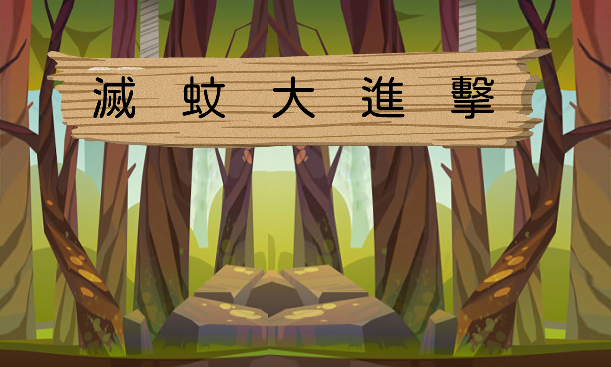
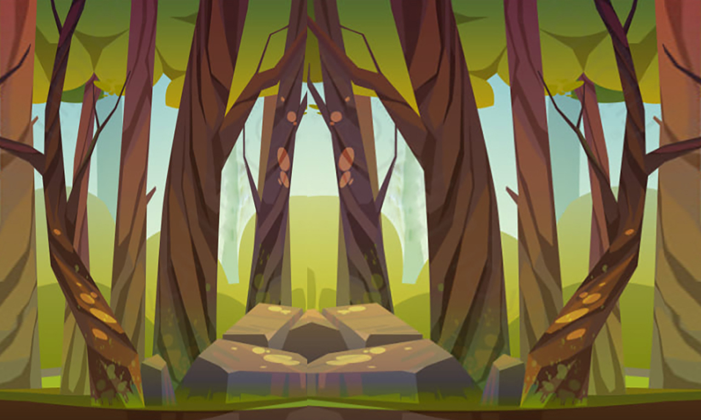

# 🦟 滅蚊大進擊 (Mosquito Hunter)

一個使用 Python + Pygame 開發的射擊遊戲，玩家控制噴霧罐消滅來襲的蚊子！



## 🎮 遊戲特色

- **經典射擊玩法**：控制噴霧罐射擊消滅蚊子
- **動態難度系統**：每200分蚊子會加速，挑戰性逐漸提升
- **完整音效系統**：背景音樂、射擊音效、蚊子叫聲等
- **精美UI介面**：主選單、遊戲介面、結束畫面
- **暫停功能**：支援遊戲暫停和繼續
- **動畫效果**：蚊子翅膀擺動、爆炸特效

## 🚀 快速開始

### 系統需求
- Python 3.7+
- Pygame 2.0+

### 安裝步驟

1. **克隆專案**
```bash
git clone https://github.com/your-username/mosquito-hunter.git
cd mosquito-hunter
```

2. **安裝依賴**
```bash
pip install pygame
```

3. **執行遊戲**
```bash
python code/Game.py
```

或者直接執行編譯後的執行檔：
```bash
./Game.exe
```

## 🎯 遊戲操作

| 按鍵 | 功能 |
|------|------|
| **方向鍵** | 移動噴霧罐 |
| **空白鍵** | 射擊 |
| **P** | 暫停/繼續遊戲 |
| **ESC** | 離開遊戲 |
| **滑鼠** | 選單操作 |

## 🏆 遊戲規則

- **目標**：消滅所有來襲的蚊子
- **生命**：玩家有3條生命
- **血量**：每條生命有100點血量
- **計分**：每隻蚊子根據大小給予不同分數
- **難度**：每200分蚊子會加速

### 評價系統
- **0-799分**：下次會更好
- **800-1600分**：感謝你對睡眠的貢獻
- **1601-2399分**：你真是太棒了！
- **2400-2999分**：你簡直是滅蚊專家！！！
- **3000-3999分**：蚊子看到你就嚇死了！！！
- **4000分以上**：你真的很討厭蚊子...

## 🛠️ 技術架構

### 程式結構
```
mosquito-hunter/
├── code/                 # 主要程式碼
│   ├── Game.py          # 遊戲主程式
│   ├── Player.py        # 玩家角色類別
│   ├── Mosquito.py      # 蚊子敵人類別
│   ├── Bottle.py        # 子彈類別
│   ├── Boom.py          # 爆炸效果類別
│   ├── Draw.py          # UI繪製功能
│   ├── sound_a.py       # 音效管理
│   └── inf.py           # 程式說明
├── img/                  # 圖片資源
├── sound/               # 音效資源
├── Game.exe             # 編譯後的執行檔
└── README.md            # 專案說明
```

### 核心技術
- **Pygame**：遊戲引擎和圖形渲染
- **Sprite系統**：遊戲物件管理
- **碰撞檢測**：矩形和圓形碰撞判斷
- **音效系統**：背景音樂和音效播放
- **動畫系統**：幀動畫和狀態切換

## 🎨 遊戲截圖

### 主選單


### 遊戲畫面


## 🔧 開發環境

- **Python版本**：3.11
- **Pygame版本**：2.5.0
- **開發工具**：VS Code / PyCharm
- **作業系統**：Windows 10/11

## 📝 更新日誌

### v1.0.0
- 初始版本發布
- 完整的遊戲功能
- 音效和動畫系統
- UI介面設計

## 🤝 貢獻指南

歡迎提交 Issue 和 Pull Request！

1. Fork 這個專案
2. 創建你的功能分支 (`git checkout -b feature/AmazingFeature`)
3. 提交你的更改 (`git commit -m 'Add some AmazingFeature'`)
4. 推送到分支 (`git push origin feature/AmazingFeature`)
5. 開啟一個 Pull Request

## 📄 授權條款

這個專案採用 MIT 授權條款 - 查看 [LICENSE](LICENSE) 檔案了解詳情

## 👨‍💻 作者

**你的名字**
- GitHub: [@your-username](https://github.com/your-username)
- Email: your.email@example.com

## 🙏 致謝

- 感謝 Pygame 社群提供的優秀遊戲開發框架
- 感謝所有提供音效和圖片資源的創作者
- 感謝測試和回饋的玩家們

---

⭐ 如果這個專案對你有幫助，請給個星星支持一下！ 